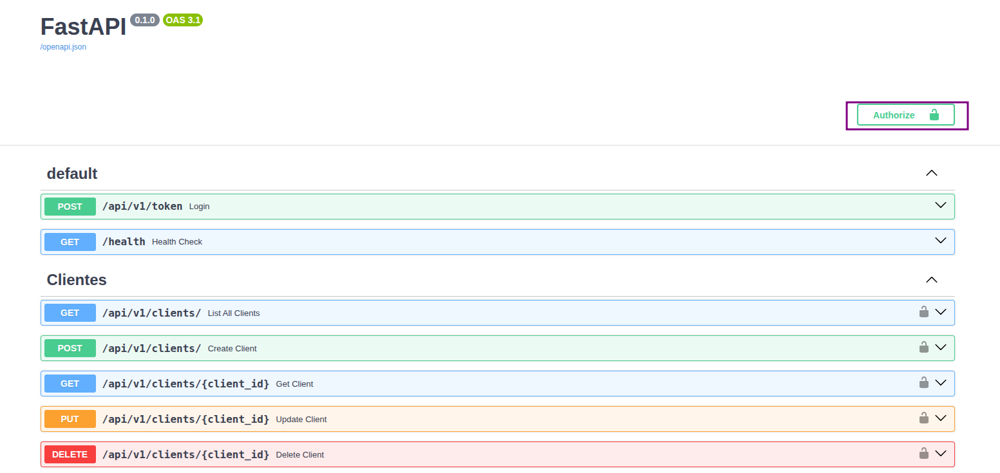
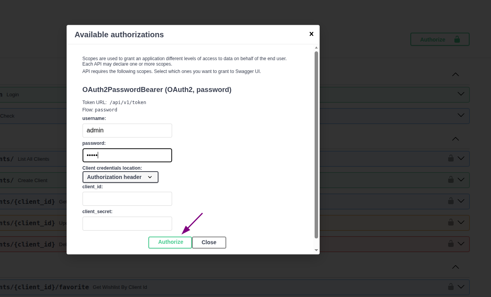
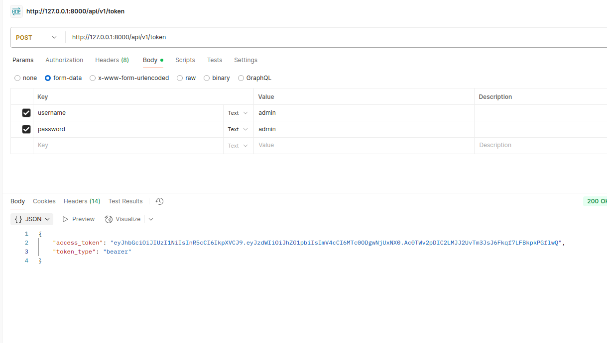
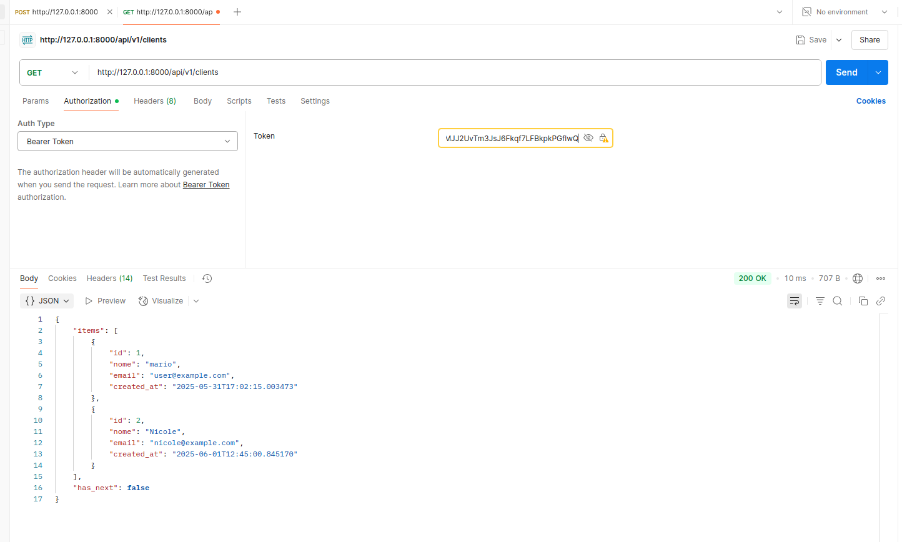
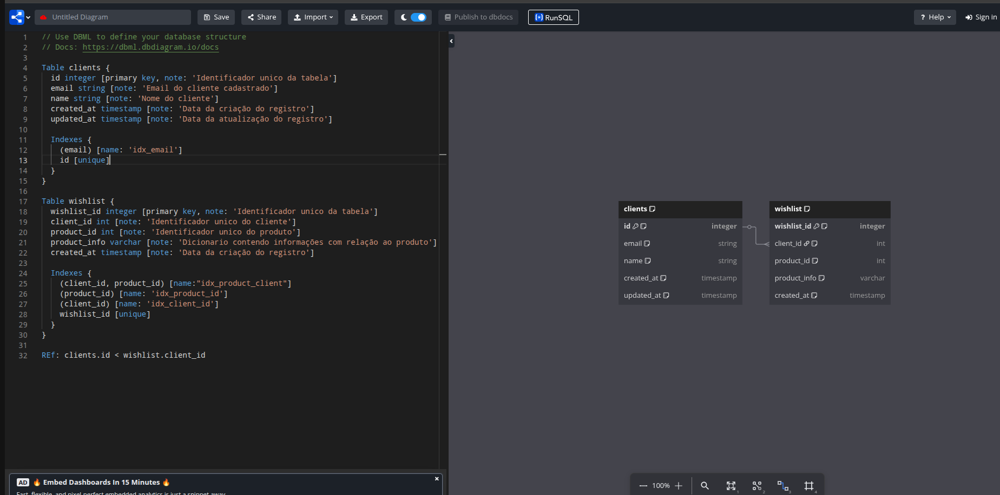

# Luiza Labs Desafio  [](LICENSE)  


## Conteúdos
- [Introdução](#Introdução)
- [Estrutura do projeto](#Estrutura)
- [Arquitetura](#Arquitetura)
- [Instalação](#installation)
- [Utilização](#Utilização)
- [Times](#Times)

## Introdução
Este desafio tem como objetivo criar uma Wishlist para o cliente.

**Casos de uso**: Um caso de uso é o cliente que deseja salvar uma lista de produtos favoritos para compra-los posteriormente.


## Estrutura do projeto

```
.

├── src                                       # Código fonte da aplicação
|   ├── api                                   # Camada responsável pelas rotas e lógica da API
|   │   ├── routers                           # Contém as rotas/endpoints da API
|   │   └── services                          # Contém a lógica de negócios e serviços da aplicação
|   └── utils                                 # Funções utilitárias pra toda aplicação e helpers auxiliares
|   │   ├── database                          # Camada de acesso ao banco de dados
|   │   ├── exceptions                        # Definição de exceções personalizadas
|   │   ├── helpers                           # Funções auxiliares
|   │   ├── models                            # Camada de modelagem dos dados
|   │   ├── repositories                      # Camada que implementa a lógica de acesso e manipulação do banco de dados
|   │   └── schemas                           # Define os schemas usados nas requisições e respostas da API (Pydantic, etc.)
├── tests                                     # Testes unitários
├── Dockerfile                                # Arquivo de configuração e execução do container da api
├── docker-compose                            # Arquivo de infraestrutura em container
├── pytest.ini                                # Arquivo de configuração do pytest
└── requirements.txt                          # Lista de dependências do projeto Python


```

## Instalação
Para executar é muito simples, basta criar uma venv dentro da pasta no mesmo nivel do arquivo requirements.txt e seguir os passos abaixo.

## Pré-requisitos
* python3.10
* dependencias especificadas no requirements.txt
* Docker

## Execução da API
```bash
# download do rojeto
git clone https://github.com/Mario-De-Castro/luiza_labs_desafio.git
cd luiza_labs_desafio

# Criação do ambiente virtual
python -m venv venv
. venv/bin/activate

# iNStalação das dependencias
pip install -r requirements.txt

#variaveis de ambiente no arquivo .env
DATABASE_URL='URL DE CONEXÃO COM A BASE DA DADOS POSTGRESQL CRIADA NO DOCKER-COMPOSE'
SECRET_KEY='TOKEN PARA CRIPTOGRAFIA E DESCRIPTOGRAFIA DA MENSAGEM JWT'

# start application
uvicorn src.main:app --reload

```

### Build local

```shell
docker-compose up --build
```

## Documentação da API (Swagger)

DEV - http://127.0.0.1:8000/api/docs


## Como se autenticar na API

Como essa API é para somente um desafio, não foi criado nenhum tipo de sistema complexa com formulario de cadastro de clientes definindo seu escopo e perfil, então foi deixado que o usuario e senha de autenticação da API é admin e admin.

### Como se autorizar no swagger

Para se autorizar no swagger basta seguir os passos abaixo.

1° Clique no botão 'Authorize' no começo da pagina.




2° Adicione as credenciais e clique em 'Authorize' e pronto a API ja esta pronta para consumo.




### Como se autenticar utilizando o postman

Para autorizar na API utilizando o postman basta voce seguir os seguintes passos.

1° Consulta o endpoint /token informando em um form-data as credenciais nos campos username e password, como mostra o exemplo abaixo;



2° Pegando o token da resposta do passo anterior, basta adicionar o token no Authorization na rota em que voce esta desejando consultar




## Arquitetura da base de dados

Para modelar as tabelas, indices e nome dos campos foi utilizado a ferramenta dbdiagram (https://dbdiagram.io/), o script criado foi disponibilizado em assets/dbdiagram, basta copiar e colar o mesmo no site.



## Testes unitarios

Para executar o teste unitario é necessario se atentar de instalar as bibliotecas necessarias que está em requirements_test.txt, Após instalar o requirements basta executar o seguinte comando em seu terminal.

Observação: Se voce usa linux pode manter do jeito que esta, se voce usa Windows adapte o souce_path no arquivo conftest.py

```shell
pytest
```

## Perfomance das queries.

Para cada querie de busca do sistema fiz um EXPLAIN para verificar se as mesmas estão usando indices e se os mesmo foram feito corretamente, o arquivo SQL esta em assets/queries